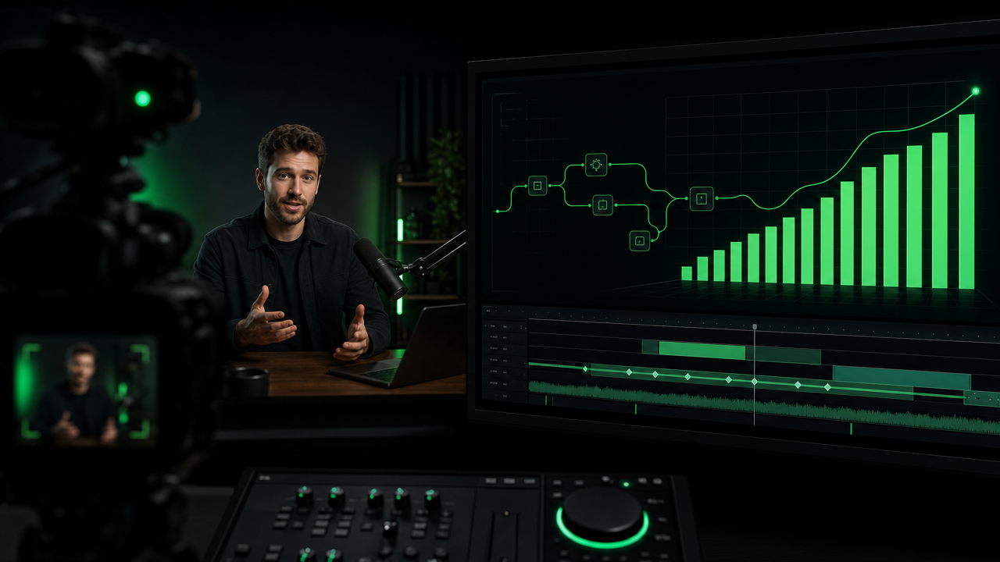

# impromptu

> Agent-driven presenter video production: brainstorm with Hermes, record against a
> voice-following teleprompter, and let the compositor turn one take into a finished
> YouTube video with motion graphics — no manual editing, ever.

<p align="center">
  
</p>

`impromptu` is a video-production studio you drive from a terminal and from an
AI agent. You write the narrative and perform in front of a camera; the tool
(and your agent) handle the structure, timing, motion graphics, and packaging.
The whole loop resolves around a single editable file, `production.yaml`, which
is the one source of truth from the first paragraph to the final upload.

---

## How it works — the loop

```
 1. brainstorm with an agent   → it writes production.yaml (script + intent)
 2. record against the prompter→ a voice-following teleprompter scrolls as you speak
 3. reconcile                   → measures what you ACTUALLY said (per scene)
 4. direct                      → cuts scenes, chooses presenter treatment + transitions
 5. make the boards             → motion graphics authored to the measured durations
 6. skim production.yaml        → overrule anything you disagree with
 7. render + package            → master.mp4 + chapters + thumbnail + checklist
```

You never touch a timeline or edit video. Steps 3–5 are one sentence each to
your agent (or one command). **Order matters:** boards are authored *after*
the recording, against real measured durations — a graphic is born knowing it
must be exactly 23.4 seconds long, animating to fit the words you actually said.

---

## Requirements

- **Python 3.11+** (stdlib for the CLI; `uv` recommended for the server).
- **FFmpeg 7+** with `ffprobe` on `PATH`.
- **MLT** (`mlt`, `mlt-qt6`) — provides `mlt-melt` for compositing.
- **Podman 4+** — for the batteries-included studio container (optional: you can
  run everything bare if MLT/ffmpeg are installed).
- **whisper.cpp** (`whisper-cli`) — for reconciling a take via real inference.
- **HyperFrames** (Node 22 + `chrome-headless-shell`) — for rendering boards.
  The container image bundles all of this; see [Setup](#setup).

The fully-assembled studio image installs every dependency and runs the whole
thing as a service on `http://127.0.0.1:8787`.

---

## Setup

**With the container (recommended).** Build the image, install the systemd
unit, and start the studio service:

```bash
cd ~/workspace/github.com/dark5un/impromptu \
  && podman build -t localhost/impromptu:latest -f containers/Containerfile . \
  && cp quadlets/studio.container ~/.config/containers/systemd/ \
  && systemctl --user daemon-reload \
  && systemctl --user start studio.service \
  && curl -s http://127.0.0.1:8787/healthz   # {"status":"ok"}
```

> If you develop inside a distrobox while podman/systemd live on the host, run
> those four commands through `distrobox-host-exec` — bare `podman` from the
> container builds into the wrong image store, and bare `systemctl --user`
> talks to the wrong user manager.

The container mounts `~/workspace/videos` read-write so productions you render
appear on your host immediately. Create that directory (and
`~/workspace/impromptu-models` for the whisper model) before first start.

**Bare (no container).** Install the Python deps with `uv sync --extra web`,
ensure `mlt-melt`, `ffmpeg`, `ffprobe`, `whisper-cli` and `hyperframes` are on
`PATH`, then use `impromptu serve --videos path/to/videos` instead of the
systemd unit.

---

## The document: `production.yaml`

Every production lives in its own directory. The heart of it is one YAML file.
Here is a complete, valid example:

```yaml
schema: 1
title: "Why Immutable Beats Configuration Management"

target:
  orientation: landscape        # landscape | vertical — set once, constrains everything
  resolution: [1920, 1080]
  fps: 30

media:                          # named sources, never positional arguments
  drift-chart: {type: board, src: boards/drift.html}
  broll-racks:  {type: video,  src: media/racks.mp4}

presenter:
  source: takes/take-03.mp4

scenes:
  - id: the-numbers
    say: |                       # the script lives with its scene
      Here is what the drift numbers actually say.
    planned_sec: 23.0            # estimate, before recording
    measured_sec: null           # written by `impromptu reconcile`
    segments: null               # written by `impromptu reconcile`
    presenter: corner            # fullscreen | corner | hidden
    overlay: drift-chart         # by name, resolving into `media`
    transition: {type: wipeleft, dur: 0.4}
```

Before recording, `measured_sec` and `segments` are `null`. `reconcile` fills
them from your take, and only then are boards authored. The validator
(`impromptu validate`) rejects unknown keys and non-contiguous timings.

---

## Step-by-step: a full example

Let's make a three-scene video end to end. Everything below is runnable; the
example directory is `videos/chapter-01`.

### Step 1 — create the production

```bash
impromptu new videos/chapter-01
```

This scaffolds the directory with a sample `production.yaml`. (When you work
with an agent, the agent writes this file for you from your brainstorm.)

### Step 2 — record against the teleprompter

With the studio running, open `http://localhost:8787`, pick the production, and
press **Follow my voice**. The prompter scrolls as you speak. Save your take as
`videos/chapter-01/takes/take.mp4`.

### Step 3 — reconcile: measure what you actually said

```bash
impromptu reconcile videos/chapter-01 -t takes/take.mp4
```

This runs whisper against the take, assigns each spoken segment to its scene,
and writes `measured_sec` + `segments` into the document. It also writes a
`drift-report.md` so you can see where you ran long or short. If your take is
too short for the script, reconcile **refuses** to write durations that overrun
it and tells you how far off you are.

### Step 4 — direct: cut scenes and transitions

```bash
impromptu direct videos/chapter-01
```

The agent-style director fills in any `null` presenter treatment and
transitions, picking a hard cut on pivots, a dissolve on reflections, a wipe on
lists — and retimes every scene onto what you actually said. It never overrides
a decision you already made; pass `--force` if you want its opinion over yours.

### Step 5 — make the boards

```bash
impromptu boards videos/chapter-01
```

Renders each `media: {type: board}` HTML to a cached ProRes 4444 alpha video
via HyperFrames, **authored against the measured duration**. The one-frame
duration guard makes a graphic that doesn't match its scene a build error, not
a frozen frame.

### Step 6 — skim the document, overrule what you disagree with

```bash
$EDITOR videos/chapter-01/production.yaml
```

This ten-second read is the judgement checkpoint. Change any `presenter`,
`transition`, or `overlay` you disagree with; your edits survive the next
`direct` run unless you pass `--force`.

### Step 7 — render and package

```bash
impromptu render  videos/chapter-01            # full-res master via MLT
impromptu package videos/chapter-01            # loudnorm + chapters + thumbnail + checklist
```

Output is written to `videos/chapter-01/out/`:

| Artifact | What it is |
|---|---|
| `master.mp4` | the finished video, H.264 + AAC, 48 kHz |
| `chapters.txt` | chapter markers from measured scene timings |
| `description.md` | title and description ready to paste |
| `thumbnail.png` | 1280×720 still |
| `upload-checklist.md` | manual-review checklist |

**Upload is always manual.** `impromptu` never uploads anything.

### Step 8 — use the web UI and phone remote

With the studio running:

```bash
impromptu pair     # prints a /remote?token=... URL for your phone
```

The phone remote gives you pause/resume, seek, and speed control while you
present. MCP exposes 12 intent-shaped tools so your agent can drive the whole
pipeline (`reconcile_run`, `direct_run`, `boards_build`, `render_start`,
`package_run`, …) over the same port.

---

## CLI reference

```
impromptu new <dir>                    scaffold a production directory
impromptu validate <dir>               validate the document, fail with line numbers
impromptu migrate <v1-dir> <out-dir>   convert a v1 project to production.yaml
impromptu reconcile <dir> -t take.mp4  whisper -> measured_sec + per-segment timings
impromptu direct <dir> [--force]       scenes, presenter treatment, transitions
impromptu boards <dir>                 render boards/*.html to cached ProRes alpha .mov
                                       (run AFTER reconcile: enforces the duration guard)
impromptu render <dir> [--vertical]
              [--chroma {420,444}]     document -> MLT XML -> mlt-melt -> master.mp4
impromptu package <dir>                loudnorm + chapters + thumbnail + checklist
impromptu pair                         QR/token URL for phone-as-remote
impromptu serve --videos <dir>         web UI + MCP (what the container runs)
```

Render quality notes:

- `--chroma 444` (opt-in, default is 420) requests High 4:4:4 Predictive for
  sharper saturated thin text — best for dense boards — but needs `libx264` and
  is rejected by some players. The container always ships x264; a bare host may
  fall back to `libopenh264` (no 4:4:4, so `--chroma 444` there is an explicit
  error telling you so).

### Legacy v1 commands

The original ffmpeg-stitch pipeline remains available and covered by tests:

```
impromptu script.md                    # terminal teleprompter
impromptu composite plan.json -p me.mp4 -g g0.mp4 -o final.mp4     # Mode A
impromptu build-hf plan.json -p me.mp4 -o hf_project/ [--vertical] # Mode B
impromptu render-hf hf_project/ -o final.mp4 [--quality draft|standard|high]
impromptu package final.mp4 --plan plan.json [--transcribe]
```

New production work should use the `production.yaml` (v2) flow above; the v1
commands are kept for compatibility and quick one-off stitches.

---

## Tests

```bash
uv run pytest -q                          # 202 passing, 0 skipped
uv run ruff check .
node --test tests/test_speech_matcher.mjs # 16 passing
```

The suite covers the document validator, the real rendering/compositing
pipeline (pixel-truth board compositing), take-length guarantees, the web
socket/queue contracts, and the vendored speech matcher.

---

## Documentation

- `docs/document-schema.md` — the normative `production.yaml` schema
- `docs/decisions.md` — rendering, encoder, alpha, and container decisions
- `docs/studio.md` — the server, UI, MCP, container, and how it runs on your host
- `docs/transitions.md` — the transition grammar
- `docs/v2-traceability.md` — what is verified by real execution vs. static
- `docs/fixed-board-alpha-convention.md` — a pixel-level debugging case study

---

## License

impromptu is **MIT** — Panagiotis Xynos (hi@onlyascii.io). See `LICENSE`.

impromptu's own code stays MIT because it invokes LLM/rendering tooling as
subprocesses rather than linking it: MLT's `mlt-melt` (GPL-2+) and the
libx264-enabled ffmpeg (GPL-2+) are run as separate programs, never linked.
Full traceability of every bundled and invoked dependency — including GSAP,
which is under the GreenSock Standard "No-Charge" license and is **not** an
opensource license — is in [`THIRD-PARTY-NOTICES.md`](THIRD-PARTY-NOTICES.md).